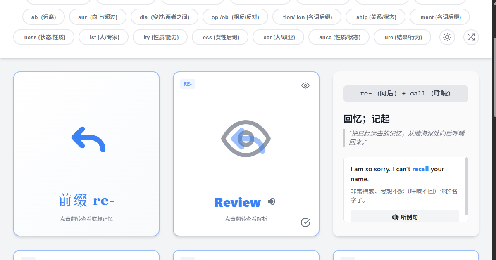
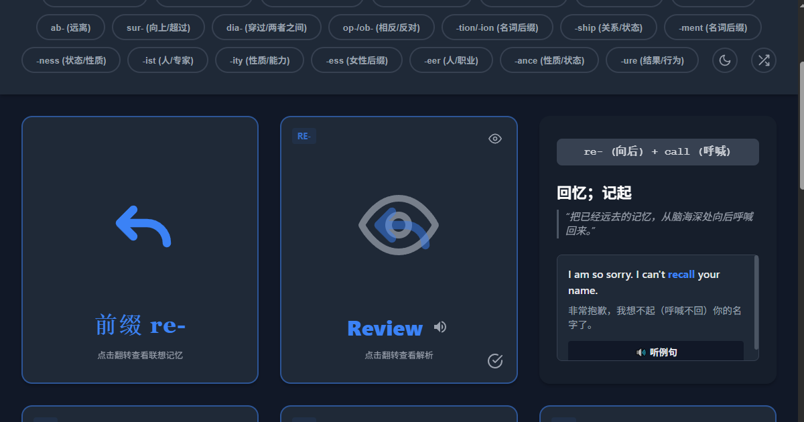
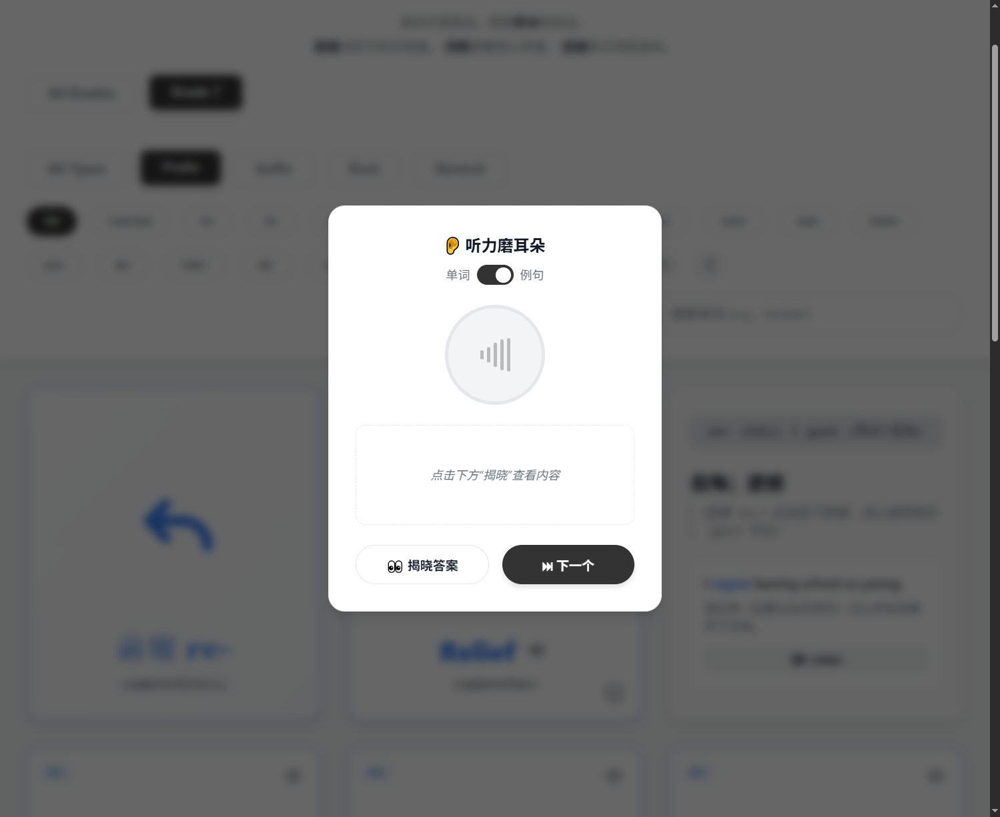
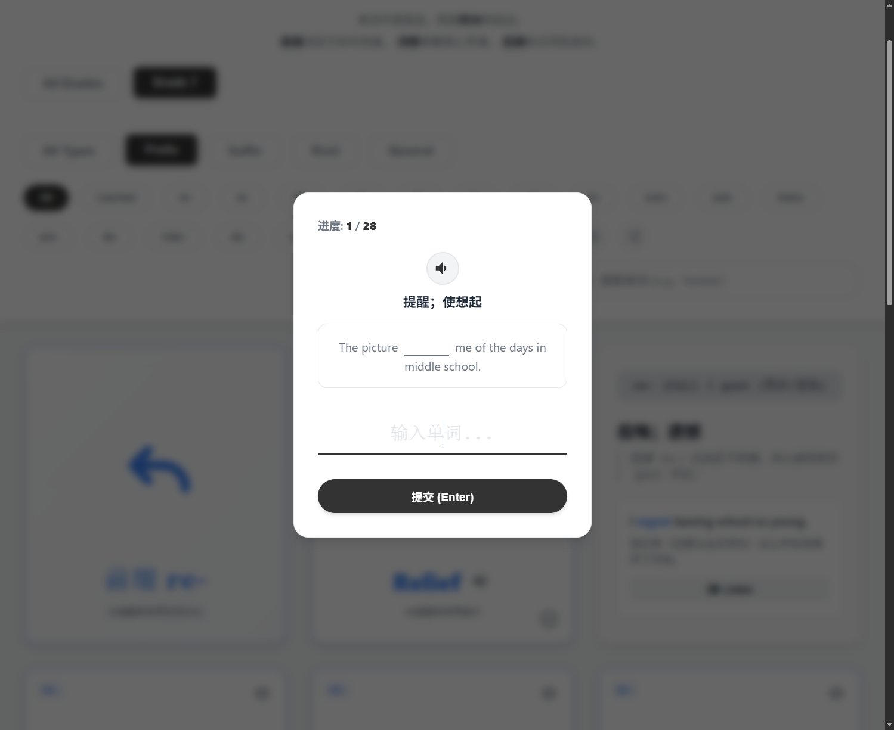
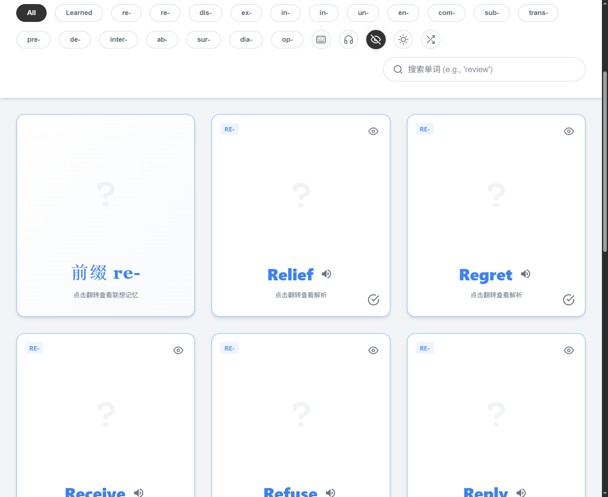

# RootCards - 词源意境记忆卡 🃏

[](https://developer.mozilla.org/zh-CN/docs/Web/Guide/HTML/HTML5)
[](https://developer.mozilla.org/zh-CN/docs/Web/CSS)
[](https://developer.mozilla.org/zh-CN/docs/Web/JavaScript)
[](https://www.python.org)
[](https://opensource.org/licenses/MIT)

一个基于**词源学**的可视化英语单词记忆工具，让背单词像看图一样简单、高效。

---

## 🌟 项目简介

**RootCards** 是一个交互式的 Web 应用，旨在改变传统枯燥的单词记忆方式。它通过“词源意境”的方法，将每个单词分解为其核心的**前缀 (prefix)**、**词根 (root)** 和**后缀 (suffix)**，并利用 SVG 动画将抽象的词源含义可视化，帮助学习者建立图像化、逻辑化的记忆联想，从而更深刻地理解和记住单词。

本项目是一个功能完备的 **PWA (Progressive Web App)**，完全使用原生 HTML, CSS, 和 JavaScript (ES6 Modules) 构建，无任何外部框架依赖，展示了现代前端开发的模块化、高性能和可维护性。

## ✨ 核心功能

*   **🃏 交互式3D翻转卡片**: 点击卡片可在“视觉意境”和“逻辑解析”之间流畅翻转。
*   **🎨 动态SVG可视化**: 每个单词的词缀和词根都配有专属SVG图形，生动展示其核心含义。
*   **🧠 多维度学习与测试**:
    *   **✍️ 拼写打字模式**: 通过听音、看中文释义和例句填空，进行主动回忆式训练，有效巩固单词拼写。
    *   **🎧 听力磨耳朵模式**: 可选择只听单词或例句，先听后看，锻炼听力反应。
    *   **🙈 无图自测模式**: 一键隐藏卡片正面的提示图片，方便进行自我检测，检验记忆效果。
    *   **🔍 智能实时搜索**: 用户输入时即时过滤单词，快速定位目标词汇。
*   **📊 个性化学习与追踪**:
    *   **💾 学习进度跟踪**: 可将单词标记为“已掌握”，应用会自动将其隐藏并通过 LocalStorage 持久化保存进度。
    *   **📚 自定义单词本**: 创建自己的单词本，或直接粘贴英文文本，应用会**利用Web Worker在后台自动提取生词**，生成可供学习的卡片组。
    *   **📝 卡片笔记**: 为每个单词卡片添加个性化的联想笔记，加深记忆。
    *   **⏪ 撤销操作**: 误操作？一键撤销“标记为已掌握”的动作，学习过程更安心。
*   **🏆 游戏化与可视化**:
    *   **🏅 学习成就系统**: 通过完成学习任务（如连续打卡、掌握一定数量的单词）来解锁成就徽章，增加学习动力。
    *   **🔥 学习热力图**: 以 GitHub 风格的热力图直观展示过去一年的学习轨迹和活跃度。
*   **🧩 智能筛选与排序**:
    *   按**学习阶段** (初中、高中、CET-4 等) 或**内容类型** (前缀/后缀/词根) 进行专项学习。
    *   直接学习**自定义单词本**或查看所有**已掌握**的单词。
    *   **随机排序**卡片，打破固定顺序，强化记忆效果。
*   **🚀 PWA & 现代化用户体验**:
    *   **📱 PWA离线支持**: 可“安装”到桌面或手机主屏幕，像原生App一样离线使用。
    *   **🔊 高品质离线发音**: 支持单词和例句的离线语音朗读，提供清晰一致的发音体验。
    *   **🌓 优雅的主题切换**: 支持浅色/深色模式。首次访问时自动适配系统偏好，并记住你的选择。
    *   **🧘‍♂️ 沉浸式学习模式**: 一键隐藏顶部导航栏，提供无干扰的学习环境。
    *   **🚀 无限滚动加载**: 采用 `Intersection Observer API` 实现卡片无限滚动加载，优化性能，加载期间显示优雅的**启动屏**和**骨架屏**。
    *   **💻 响应式设计**: 完美适配桌面和移动设备，在手机上提供接近原生App的交互体验。

## 📸 截图

**主界面 (浅色/深色模式)**
<p align="center">
  
  
</p>

**交互式学习模式 (听力/打字/自测)**
<p align="center">
  
  
  
</p>

## 🛠️ 技术栈

*   **前端**: `HTML5`, `CSS3`, `JavaScript (ES6+)`
*   **NLP处理**: `compromise.js` (用于单词本的文本提取)
*   **音频生成**: `Python 3`, `gtts`, `mutagen` (脚本)
*   **核心技术**:
    *   **PWA & Service Worker**: 实现应用的可安装性、离线访问和资源缓存。
    *   **Web Workers**: 在后台线程处理耗时的NLP任务（单词提取），避免UI卡顿。
    *   **JavaScript 模块化 (ESM)**: 将代码逻辑清晰地分离到 `app.js` (协调器), `state.js` (状态管理), `ui.js` (UI渲染) 以及多个功能模块中。
    *   **CSS 变量**: 用于实现高效、可维护的主题切换（深色/浅色模式）和动态样式。
    *   **CSS Flexbox & Grid**: 用于现代化响应式布局。
    *   **Fetch API**: 异步加载词汇数据。
    *   **LocalStorage**: 持久化存储用户学习进度、单词本、笔记和主题偏好。
    *   **Intersection Observer API**: 实现高效的无限滚动加载。
    *   **`window.matchMedia`**: 检测用户系统的色彩模式偏好。

## 🔊 音频文件生成

为了保证发音的质量和跨浏览器的一致性，本项目使用预先生成的 MP3 文件，而不是依赖浏览器的语音合成 API。我们提供了一个Python脚本来自动完成这个过程。

1.  **脚本位置**: `generate_audio.py`。
2.  **安装依赖**:
    ```bash
    # 推荐在虚拟环境中安装
    pip install gtts mutagen
    ```
3.  **运行脚本**: 在项目根目录下运行脚本。它会自动读取 `data/manifest.js` 中定义的所有 JSON 文件，并为每个单词和例句生成对应的音频文件。
    ```bash
    python generate_audio.py
    ```
4.  **输出**: 音频文件将被保存在 `audio/words/` 和 `audio/sentences/` 目录下。

> **注意**: 每当您添加了新的词汇JSON文件后，都需要重新运行此脚本来生成对应的音频。

## 🚀 本地运行

1.  克隆本仓库到本地:
    ```bash
    git clone https://github.com/git-hub-cc/RootCards.git
    ```
2.  进入项目目录:
    ```bash
    cd RootCards
    ```
3.  **[重要]** 首次运行或更新词汇后，请先生成音频文件（详见上一节）：
    ```bash
    # 安装依赖 (仅首次需要)
    pip install gtts mutagen
    # 运行脚本生成音频
    python generate_audio.py
    ```
4.  由于项目使用了 ES Modules，需要通过一个本地服务器来运行，以避免 CORS 策略问题。
    *   如果你安装了 VS Code，可以使用 [Live Server](https://marketplace.visualstudio.com/items?itemName=ritwickdey.LiveServer) 插件一键启动。
    *   或者使用 Node.js 的 `http-server`:
        ```bash
        # 全局安装 http-server (仅需一次)
        npm install -g http-server
        # 在项目根目录运行
        http-server
        ```
5.  在浏览器中打开服务器提供的地址即可。

## 🧩 扩展新词汇

扩展词汇库非常简单：

1.  在 `data/` 目录中，根据分类（如 `high/root/`）创建一个新的 JSON 文件，例如 `new_root.json`。
2.  遵循现有 JSON 文件 (如 `re.json`) 的数据结构，填写词根/词缀信息、主题色、单词列表等。
3.  打开 `data/manifest.js` 文件。
4.  将新文件的路径添加到 `DATA_FILES` 数组中：
    ```javascript
    const DATA_FILES = [
      // ... existing files
      'data/high/root/new_root.json',
    ];
    ```
5.  **重新运行音频生成脚本**以创建新单词的音频文件。
6.  完成！刷新页面，新的词汇组和筛选按钮就会自动出现。

## 📅 未来计划

- [ ] 新增更多高级词汇，如 GRE、TOEFL。
- [ ] 增加更多游戏化学习元素，丰富成就系统。
- [ ] 引入 AI 对话练习模式，在真实语境中运用单词。

## 🙏 致谢

*   学习资料来源：韩宇极简英语。
*   部分内容由 AI 辅助生成，如 Gemini, gTTS。
*   GRE/TOEFL 词库参考自 [english-wordlists](https://github.com/mahavivo/english-wordlists)。
*   NSDR 音频素材来自 [ZoeLanguages](https://www.bilibili.com/video/BV1X2NZesE2J/)。

## 📜 许可证

该项目采用 [MIT](./LICENSE) 许可证。